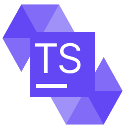

# [T-Sol (Threaded Solidity)](https://github.com/tonlabs/TON-Solidity-Compiler/blob/master/API.md) plugin for JetBrains IDEs

![[JetBrains plugins]](https://img.shields.io/jetbrains/plugin/d/20696-t-sol.svg)

[](https://plugins.jetbrains.com/idea/plugin/20696-t-sol)

**T-Sol** (short for **Threaded Solidity**) JetBrains IDEs plugin is designed to make writing TVM-based smart contracts more comfortable and faster. It is based on [Sergey Tselovalnikov](https://github.com/SerCeMan)'s [original Solidity plugin](https://github.com/intellij-solidity/intellij-solidity) (kudos!) and features syntax prompts and autofilling while writing code. The plugin is also open-source and was released under the MIT license.

T-Sol proposes Threaded Solidity, the new name for TVM-based Solidity and works with files with the `.tsol` extension, making it easier to navigate between EVM and TVM smart contract files, which previously had the same `.sol` extension.

## Features

* Syntax highlighting
* Code completion
* File templates
* Goto declaration
* Find usages
* Code formatting

## Supporting the plugin

You can support the development by clicking ★ on GitHub and rating it on the [plugin page](https://plugins.jetbrains.com/plugin/20696-t-sol).

## Reporting an issue

Please attach the screenshot for every issue if possible. It will make the issue much clearer and easier to understand.

## Build

```bash
./gradlew buildPlugin
```

## Run

```bash
./gradlew runIdea
```

## Contribute

Contributions are always welcome!
